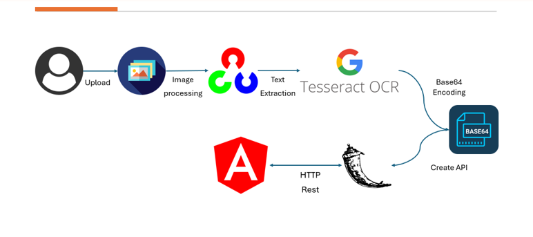
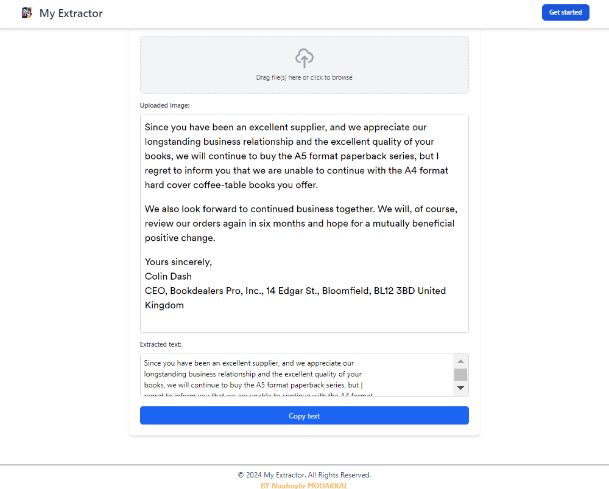

# My Extractor

## Description
**My Extractor** est une application web permettant d'extraire du texte à partir d'images grâce à **Tesseract OCR**, **OpenCV**, et une architecture basée sur **Angular** et **Flask**.

---

## Fonctionnalités
- Téléchargement et traitement d'image.
- Extraction précise de texte via Tesseract OCR.
- Interface intuitive pour copier le texte extrait.

---

## Architecture

L'application suit une architecture modulaire :
1. Téléchargement d'image (Frontend Angular).
2. Traitement via OpenCV.
3. Extraction de texte avec Tesseract OCR (Backend Flask).
4. Encodage Base64 et communication via API REST.



---

## Démarrage rapide

### Prérequis
- Node.js, Python, Angular CLI, Tesseract OCR.

### Installation

1. **Frontend** :
   ```bash
   cd frontend
   npm install
   ng serve
   ```
2. **Backend** :
   ```bash
   cd backend
   python ocr.py
   ```

Accédez à l'application sur [http://localhost:4200](http://localhost:4200).
---

## Demo



---

## Auteur
**Nouhayla Mouakkal** 
